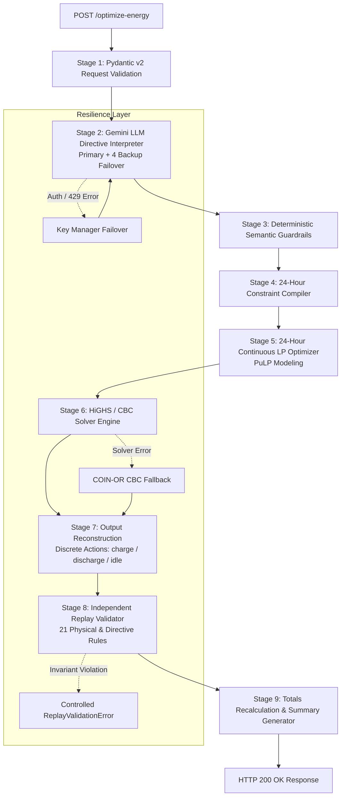

# GridWise LLM Energy Optimizer

> **LLM-Assisted 24-Hour Smart Campus Energy Optimization Service for BUP CSE Fest 2026 Hackathon**

[](https://www.python.org/)
[](https://fastapi.tiangolo.com/)
[](https://coin-or.github.io/pulp/)
[](https://docs.pydantic.dev/)
[](https://www.docker.com/)
[](https://gridwise-llm-optimizer-production.up.railway.app)
[](docs/TESTING.md)

> **Live Production Service:** [`https://gridwise-llm-optimizer-production.up.railway.app`](https://gridwise-llm-optimizer-production.up.railway.app)  
> **Interactive Swagger UI:** [`https://gridwise-llm-optimizer-production.up.railway.app/docs`](https://gridwise-llm-optimizer-production.up.railway.app/docs)

---

## 1. Executive Summary

**GridWise** is a hybrid AI and mathematical energy optimization web service engineered for the **BUP CSE Fest 2026 Hackathon Preliminary Round**.

The service accepts 24-hour campus energy demand, rooftop solar forecasts, time-of-use electricity tariffs, battery storage parameters, and 1 to 3 unstructured natural language operator notes. It coordinates:
1. **Semantic Interpretation**: Translates operator notes into machine-checkable typed directives.
2. **Deterministic Guardrails**: Validates all untrusted LLM outputs against strict structural and numeric invariants.
3. **Exact Global Optimization**: Solves a 24-hour continuous Linear Program (LP) using the **HiGHS** solver to minimize grid electricity costs.
4. **Independent Replay Audit**: Validates the finalized schedule against 21 physical, electrical, and directive rules before emitting an HTTP 200 response.

---

## 2. Key Implemented Capabilities

- **FastAPI Production Service**: High-performance asynchronous HTTP REST API with structured error handling.
- **Strict Role Isolation**: The LLM is used **strictly** for semantic parsing—it never calculates math, solves optimization equations, or generates grid numbers.
- **6 Supported Directives**: Comprehensive support for all official directive types: `solar_reduction`, `minimum_battery_reserve`, `no_charge_window`, `no_discharge_window`, `max_grid_window`, and `no_op`.
- **Deterministic Guardrails**: Structural validation for note indexing, hour bounds ($0..23$), factor bounds ($0.0 \le \text{factor} \le 1.0$), battery reserves, and null safety.
- **Exact 24-Hour Continuous LP**: Modeled in PuLP and solved globally across the full 24-hour horizon (not a greedy heuristic).
- **Dual Solver Architecture**: Primary solver is **HiGHS** (`highspy`) with automated fallback to **COIN-OR CBC** (`coinor-cbc`).
- **Independent 21-Rule Replay Validator**: Zero-trust validator auditing energy balance, state transitions, solar limits, rate limits, and end-of-day battery neutrality.
- **Gemini Primary + 4 Backup Key Failover**: Thread-safe, circuit-breaking credential manager supporting up to 5 Gemini keys (`primary` + `backup_1` through `backup_4`).
- **Offline / Mock Mode**: Full offline execution with deterministic mock semantic parser (`LLM_PROVIDER=mock`) requiring zero API keys.
- **Comprehensive Test Suite**: 81 automated tests (unit, integration, randomized, failover, corruption, and public regression).
- **Multi-Platform Docker**: Production-ready, non-root Docker container with built-in health checking.

---

## 3. Problem Summary

The challenge requires scheduling a campus microgrid over 24 hours ($h = 0, \dots, 23$) to minimize total grid import costs while satisfying physical storage constraints and unstructured operator notes:

```text
Inputs:
  ├── 24-hour load demand forecast (kWh)
  ├── 24-hour rooftop solar forecast (kWh)
  ├── 24-hour grid electricity tariff (BDT/kWh)
  ├── Battery parameters (capacity, initial energy, minimum reserve, max charge/discharge)
  └── 1 to 3 operator notes (e.g., "Reduce solar output by 50% from 11 AM to 2 PM")

Outputs:
  ├── Structured directive interpretations (type, hours, adjustment parameters, explanation)
  ├── 24-hour hourly dispatch schedule (grid import, solar used, battery action, stored energy)
  ├── Total grid electricity consumed (kWh)
  ├── Total electricity cost (BDT)
  ├── Peak hourly grid import (kWh)
  └── Short human-readable dispatch summary
```

---

## 4. System Architecture



### Architectural Separation of Concerns
1. **LLM Interpreter**: Strictly converts natural language notes into 6 typed JSON directive objects.
2. **Deterministic Guardrails**: Validates note indexing, numerical bounds, and null-safety before constraints are compiled.
3. **Constraint Compiler**: Translates validated directives into hourly physical bounds ($0..23$).
4. **LP Optimizer**: Solves continuous energy balance, rate limits, and end-of-day battery neutrality.
5. **Replay Validator**: Audits the completed plan against 21 physical laws before any response leaves the server.
6. **Totals Recalculator**: Recomputes `total_grid_kwh`, `total_cost_bdt`, and `peak_grid_kwh` directly from the schedule rows as the single source of truth.

---

## 5. How the LLM is Used

The LLM is deployed **exclusively as a semantic parser**:

```text
Operator Note: "Due to panel cleaning, rooftop solar output drops by 50% from 11 AM to 2 PM."
                                │
                                ▼ (Gemini API Call)
{
  "note_index": 0,
  "applies": true,
  "directive_type": "solar_reduction",
  "structured_adjustment": {
    "hours": [11, 12, 13],
    "factor": 0.5
  },
  "explanation": "Solar output reduced by 50% between hours 11, 12, and 13."
}
```

### Supported Directive Contracts

| Directive Name | Adjustment Format | Rules & Semantics |
|---|---|---|
| `solar_reduction` | `{"hours": [11, 12, 13], "factor": 0.5}` | `factor` is the fraction that **remains usable** ($0.0 \le \text{factor} \le 1.0$). An "80% drop" means $20\%$ remains $\rightarrow \text{factor} = 0.20$. |
| `minimum_battery_reserve` | `{"hours": [18, 19, 20], "minimum_energy_kwh": 100.0}` | Hard lower bound on battery stored energy. Percentage notes are resolved against `battery.capacity_kwh`. |
| `no_charge_window` | `{"hours": [14, 15]}` | Battery charging prohibited ($B[h] \le 0$). |
| `no_discharge_window` | `{"hours": [17, 18]}` | Battery discharging prohibited ($B[h] \ge 0$). |
| `max_grid_window` | `{"hours": [19, 20, 21], "max_grid_kwh": 150.0}` | Upper bound on grid electricity import ($G[h] \le \text{max\_grid\_kwh}$). |
| `no_op` | `null` | Non-operational, administrative, or distractor notes. Must set `applies: false` and `structured_adjustment: null`. |

### Crucial Invariants
- **Time Convention**: All windows are **start-inclusive, end-exclusive** whole hours. "11 AM to 2 PM" $\rightarrow [11, 12, 13]$.
- **Zero Math Delegation**: The LLM does not compute schedules or costs. If the LLM produces invalid schema data, the service retries or falls back cleanly.

---

## 6. Deterministic Guardrails & Replay Validation

To prevent LLM hallucinations from degrading optimization quality, GridWise enforces a two-tier validation barrier:

### Tier 1: Semantic Guardrails (`app/core/guardrails.py`)
- Confirms exactly one interpretation exists for each input note.
- Enforces strict sequential note indexing ($0, \dots, N-1$).
- Checks that `hours` arrays are non-empty, strictly sorted, and contained within $[0..23]$.
- Enforces numerical bounds: $0.0 \le \text{factor} \le 1.0$, $\text{minimum\_energy\_kwh} \le \text{capacity\_kwh}$, and $\text{max\_grid\_kwh} \ge 0$.
- Enforces null-safety for `no_op` directives.

### Tier 2: Independent 21-Rule Replay Validator (`app/core/replay_validator.py`)
Before sending an HTTP 200 response, the finalized hourly plan is re-simulated from hour 0 to hour 23 against 21 deterministic rules:
1. **Horizon Count**: Exactly 24 records ($h = 0, \dots, 23$).
2. **Numeric Sanity**: No `NaN`, `Inf`, or negative grid/solar/battery values.
3. **Idle Consistency**: If `battery_action == "idle"`, then `battery_kwh == 0.0`.
4. **Charge Action Consistency**: If `battery_action == "charge"`, then `battery_kwh > 0.0`.
5. **Discharge Action Consistency**: If `battery_action == "discharge"`, then `battery_kwh > 0.0`.
6. **Max Charge Rate**: $\text{battery\_kwh} \le \text{max\_charge\_kwh\_per\_hour} + 10^{-4}$.
7. **Max Discharge Rate**: $\text{battery\_kwh} \le \text{max\_discharge\_kwh\_per\_hour} + 10^{-4}$.
8. **Battery State of Charge Transition**: $|E[h] - (E[h-1] \pm \text{battery\_kwh})| \le 0.01$.
9. **Capacity Limit**: $E[h] \le \text{capacity\_kwh} + 0.01$.
10. **Global Minimum Reserve**: $E[h] \ge \text{base\_minimum\_energy\_kwh} - 0.01$.
11. **Directive Dynamic Reserve**: $E[h] \ge \text{directive\_minimum\_energy\_kwh}[h] - 0.01$.
12. **Solar Resource Bound**: $\text{solar\_used\_kwh}[h] \le \text{solar\_kwh}[h] + 0.01$.
13. **Directive Solar Reduction**: $\text{solar\_used\_kwh}[h] \le \text{effective\_solar}[h] + 0.01$.
14. **No-Charge Window**: Charging strictly forbidden during directive hours.
15. **No-Discharge Window**: Discharging strictly forbidden during directive hours.
16. **Grid Import Cap**: $\text{grid\_kwh}[h] \le \text{max\_grid}[h] + 0.01$.
17. **Hourly Power Balance**: $|(\text{grid} + \text{solar\_used} + \text{discharge}) - (\text{demand} + \text{charge})| \le 0.01$.
18. **End-of-Day Neutrality**: $|E[23] - \text{initial\_energy\_kwh}| \le 0.01$ (battery cannot be depleted as free energy).
19. **Total Grid Verification**: $\sum \text{grid\_kwh} == \text{total\_grid\_kwh} \pm 0.05$.
20. **Total Cost Verification**: $\sum (\text{grid\_kwh} \times \text{tariff}) == \text{total\_cost\_bdt} \pm 0.05$.
21. **Peak Grid Verification**: $\max(\text{grid\_kwh}) == \text{peak\_grid\_kwh} \pm 0.05$.

---

## 7. Mathematical Optimization Model

GridWise formulates the campus microgrid problem as a continuous Linear Program (LP):

### Decision Variables
- $G[h] \ge 0$: Grid electricity import in hour $h$ (kWh).
- $S[h] \ge 0$: Solar energy consumed in hour $h$ (kWh).
- $B[h] \in [-\text{max\_discharge}, \text{max\_charge}]$: Signed net battery flow in hour $h$ (kWh).
- $E[h]$: Battery energy level at the end of hour $h$ (kWh).

### Objective Function
Minimize total 24-hour campus electricity cost:
$$\min \sum_{h=0}^{23} G[h] \times \text{tariff}[h]$$

### Constraints
1. **Solar Limit**: $0 \le S[h] \le \text{effective\_solar}[h]$
2. **Hourly Power Balance**: $G[h] + S[h] = \text{demand}[h] + B[h]$
3. **Storage State Evolution**:
   $$E[0] = \text{initial\_energy} + B[0]$$
   $$E[h] = E[h-1] + B[h], \quad \forall h \in \{1, \dots, 23\}$$
4. **Storage Boundaries**: $\max(\text{base\_min}, \text{reserve}[h]) \le E[h] \le \text{capacity}$
5. **No-Charge Windows**: $B[h] \le 0$
6. **No-Discharge Windows**: $B[h] \ge 0$
7. **Grid Caps**: $G[h] \le \text{max\_grid}[h]$
8. **End-of-Day Neutrality**: $E[23] = \text{initial\_energy}$ (hard equality)

---

## 8. Configuration & Environment Variables

Create a local `.env` configuration file by copying the template:

```bash
cp .env.example .env
```

### Environment Variable Reference

| Variable | Type | Default | Purpose |
|---|---|---|---|
| `LLM_PROVIDER` | `string` | `mock` | Selected LLM backend: `gemini`, `mock`, or `openai` |
| `GEMINI_API_KEY_PRIMARY` | `string` | `None` | Primary Google Gemini API key (always attempted first) |
| `GEMINI_API_KEY_BACKUP_1` | `string` | `None` | 1st fallback Gemini key (used if primary fails) |
| `GEMINI_API_KEY_BACKUP_2` | `string` | `None` | 2nd fallback Gemini key |
| `GEMINI_API_KEY_BACKUP_3` | `string` | `None` | 3rd fallback Gemini key |
| `GEMINI_API_KEY_BACKUP_4` | `string` | `None` | 4th fallback Gemini key |
| `PUKU_API_KEY` | `string` | `None` | Optional API key for Puku platform deployment |
| `GEMINI_MODEL` | `string` | `gemini-flash-lite-latest` | Gemini model name |
| `GEMINI_REQUEST_TIMEOUT_SECONDS` | `float` | `2.5` | Timeout for each individual Gemini request attempt |
| `GEMINI_TOTAL_DEADLINE_SECONDS` | `float` | `6.0` | Maximum deadline budget across all failover attempts |
| `GEMINI_MAX_ATTEMPTS` | `int` | `3` | Maximum retry/failover attempts per request |
| `PORT` | `int` | `8000` | HTTP port for Uvicorn server |
| `HOST` | `string` | `0.0.0.0` | Host IP binding |
| `LOG_LEVEL` | `string` | `INFO` | Logging verbosity (`DEBUG`, `INFO`, `WARNING`, `ERROR`) |

> **Security Guarantee**: All secrets are stored as Pydantic `SecretStr`. No raw keys are ever committed to Git, logged, or included in container builds.
>
> **Offline Evaluation**: Setting `LLM_PROVIDER=mock` requires **no API keys** and runs completely offline with deterministic rule-based semantic parsing.

---

## 9. Clean Environment Setup & Quickstart

### Prerequisites
- **Python**: 3.11 (`>= 3.11`)
- **C/C++ Compiler**: `gcc`, `g++` (required for solver bindings)
- **Solver Package** (Optional system package): `coinor-cbc`

### Step-by-Step Setup

#### Option A: Using `uv` (Fastest)
```bash
# 1. Create and activate Python 3.11 environment
uv venv --python 3.11
# On Linux/macOS:
source .venv/bin/activate
# On Windows PowerShell:
.\.venv\Scripts\Activate.ps1

# 2. Install dependencies
uv pip install -r requirements.txt
```

#### Option B: Using Standard `venv` and `pip`
```bash
# 1. Create virtual environment
python -m venv .venv

# 2. Activate virtual environment
# On Linux/macOS:
source .venv/bin/activate
# On Windows PowerShell:
.\.venv\Scripts\Activate.ps1

# 3. Upgrade pip and install dependencies
pip install --upgrade pip
pip install -r requirements.txt
```

---

## 10. Starting the Service

### Start Local Server
```bash
uvicorn app.main:app --host 0.0.0.0 --port 8000
```
Or via Makefile:
```bash
make run
```

---

## 11. Health Check & API Usage

### 1. Verify Health (`GET /health`)
The `/health` endpoint is lightweight and deterministic:

#### Using `curl` (Local vs. Live Railway):
```bash
# Local
curl http://127.0.0.1:8000/health

# Live Railway Production
curl https://gridwise-llm-optimizer-production.up.railway.app/health
```

#### Using PowerShell:
```powershell
# Local
Invoke-RestMethod -Uri http://127.0.0.1:8000/health -Method GET

# Live Railway Production
Invoke-RestMethod -Uri https://gridwise-llm-optimizer-production.up.railway.app/health -Method GET
```

#### Expected Response (`200 OK`):
```json
{
  "status": "ok"
}
```

---

### 2. Optimize Energy (`POST /optimize-energy`)

#### Using `curl`:
```bash
# Local
curl -X POST http://127.0.0.1:8000/optimize-energy \
  -H "Content-Type: application/json" \
  -d @test_request.json

# Live Railway Production
curl -X POST https://gridwise-llm-optimizer-production.up.railway.app/optimize-energy \
  -H "Content-Type: application/json" \
  -d @test_request.json
```

#### Using PowerShell:
```powershell
$payload = Get-Content -Raw -Path test_request.json

# Local
Invoke-RestMethod -Uri http://127.0.0.1:8000/optimize-energy -Method POST -ContentType "application/json" -Body $payload

# Live Railway Production
Invoke-RestMethod -Uri https://gridwise-llm-optimizer-production.up.railway.app/optimize-energy -Method POST -ContentType "application/json" -Body $payload
```

#### Response Structure:
```json
{
  "scenario_id": "TEST-CAMPUS-01",
  "directive_interpretation": [
    {
      "note_index": 0,
      "applies": true,
      "directive_type": "solar_reduction",
      "structured_adjustment": {
        "hours": [11, 12, 13],
        "factor": 0.2
      },
      "explanation": "Solar output reduced by 80% (20% remains) from 11 AM to 2 PM."
    },
    {
      "note_index": 1,
      "applies": true,
      "directive_type": "minimum_battery_reserve",
      "structured_adjustment": {
        "hours": [18, 19, 20],
        "minimum_energy_kwh": 100.0
      },
      "explanation": "Retain at least 100 kWh in battery storage from 6 PM to 9 PM."
    },
    {
      "note_index": 2,
      "applies": false,
      "directive_type": "no_op",
      "structured_adjustment": null,
      "explanation": "Visitor bus schedule update does not impact campus energy scheduling."
    }
  ],
  "hourly_plan": [
    {
      "hour": 0,
      "grid_kwh": 60.0,
      "solar_used_kwh": 0.0,
      "battery_action": "idle",
      "battery_kwh": 0.0,
      "battery_energy_after_kwh": 100.0
    }
    // ... 24 total hours ...
  ],
  "total_grid_kwh": 2479.0,
  "total_cost_bdt": 27024.50,
  "peak_grid_kwh": 185.0,
  "plan_summary": "Dispatched battery storage to minimize grid electricity costs..."
}
```

---

## 12. Automated Testing & Verification Suite

GridWise includes automated testing, public regression verification, and performance profiling:

### 1. Pytest Test Suite (81 Tests)
Runs unit models, schemas, guardrails, optimizer solvers, failover logic, and replay corruption fuzzing:
```bash
pytest
```
*Expected: `81 passed in ~16s`.*

### 2. Standalone Local Judge Evaluation Harness
Simulates the official hackathon scoring harness:
```bash
# Fast offline evaluation using deterministic mock semantic parser
python scripts/local_judge.py --input samples/public_cases.json --mock

# Live evaluation using configured Gemini provider
python scripts/local_judge.py --input samples/public_cases.json

# Live evaluation on single test scenario
python scripts/local_judge.py --input test_request.json

# Evaluate against a running HTTP server
python scripts/local_judge.py --url http://127.0.0.1:8000 --input samples/public_cases.json
```

### 3. Public Cases Benchmark Runner
Executes all 10 official public scenarios against a running instance:
```bash
python scripts/run_public_cases.py
```

### 4. Latency Benchmark Script
Validates that response times meet the competition rubric ($P95 \le 5000$ ms):
```bash
python scripts/benchmark.py http://127.0.0.1:8000 20
```

### 5. Smoke Test
End-to-end verification of `/health` and `/optimize-energy`:
```bash
python scripts/smoke_test.py http://127.0.0.1:8000
```

---

## 13. Docker Build & Execution

### 1. Build Local Image
```bash
docker build -t gridwise-llm-optimizer:latest .
```

### 2. Multi-Architecture Build (x86_64 / `linux/amd64`)
```bash
docker buildx build --platform linux/amd64 -t gridwise-llm-optimizer:latest .
```

### 3. Run Container with Environment File
```bash
docker run --rm -d -p 8000:8000 --env-file .env --name gridwise-service gridwise-llm-optimizer:latest
```

### 4. Run Container Offline (Zero Secrets)
```bash
docker run --rm -d -p 8000:8000 -e LLM_PROVIDER=mock --name gridwise-offline gridwise-llm-optimizer:latest
```

### 5. Check Container Health
```bash
docker inspect --format='{{json .State.Health.Status}}' gridwise-service
```
*Output: `"healthy"`.*

---

## 14. Fallback Docker Image Pull & Run

If running from a submitted prebuilt container image instead of building locally:

```bash
# Pull the fallback container image
# TODO: Replace with the official submission image tag if hosted on a public registry:
# docker pull <registry>/gridwise-llm-optimizer:latest
# e.g., ghcr.io/yassin-code-69/gridwise-llm-optimizer:latest

# Run the pulled image:
docker run --rm -p 8000:8000 -e LLM_PROVIDER=mock gridwise-llm-optimizer:latest
```

---

## 15. Deployment & Platform Notes

### Live Railway Production Deployment
The service is actively deployed and running in production on Railway:
- **Base Endpoint**: [`https://gridwise-llm-optimizer-production.up.railway.app`](https://gridwise-llm-optimizer-production.up.railway.app)
- **Health Check**: [`https://gridwise-llm-optimizer-production.up.railway.app/health`](https://gridwise-llm-optimizer-production.up.railway.app/health)
- **Interactive OpenAPI / Swagger UI**: [`https://gridwise-llm-optimizer-production.up.railway.app/docs`](https://gridwise-llm-optimizer-production.up.railway.app/docs)
- **Live Verification Status**: All 10 public scenarios verified passing (`Mean Latency: 1382.9 ms`, 0 errors, 100% replay audit valid).

### Platform Architecture
- **Docker Environment**: Linux Debian 12 container (`python:3.11-slim`), non-root `appuser` (UID 1000).
- **Puku / Poridhi Support**: Integrated `PUKU_API_KEY` configuration option in `app/config.py` for headless cloud sandboxes and remote runners.
- **Reverse Proxy Ready**: Supports deployment behind Nginx, Caddy, or cloud load balancers.

### Known Operational Characteristics & Limitations
- **Fixed Horizon**: Exactly 24 whole-hour periods ($h = 0, \dots, 23$). Sub-hourly intervals are out of scope.
- **Battery Roundtrip Efficiency**: Assumed 100% per competition specification guidelines.
- **Non-Export Constraint**: Grid import is non-negative ($G[h] \ge 0$); microgrid does not export power to the utility grid.
- **Simultaneous Horizon LP**: GridWise solves all 24 hours simultaneously, avoiding suboptimal greedy battery depletion early in the day.

---

## 16. Repository Structure

```text
gridwise-llm-optimizer/
├── app/
│   ├── main.py                     # FastAPI entrypoint, routes, error handlers
│   ├── config.py                   # Pydantic Settings & environment variables
│   ├── errors.py                   # Domain exception hierarchy
│   ├── schemas/
│   │   ├── request.py              # OptimizationRequest, HourInput, BatteryInput
│   │   ├── response.py             # OptimizationResponse, HourlyPlanEntry
│   │   └── directives.py           # 6 typed directive schemas
│   ├── core/
│   │   ├── guardrails.py           # Deterministic LLM output validator
│   │   ├── constraint_compiler.py  # Maps directives to 24h mathematical bounds
│   │   ├── optimizer.py            # Exact 24h continuous LP (PuLP + HiGHS/CBC)
│   │   ├── reconstruction.py       # Deconstructs signed flow into charge/discharge/idle
│   │   ├── replay_validator.py     # Independent 21-rule schedule auditor
│   │   ├── totals.py               # Deterministic totals recomputation
│   │   └── summary.py              # Automated plan summary generator
│   ├── llm/
│   │   ├── base.py                 # Abstract DirectiveInterpreter interface
│   │   ├── gemini_key_manager.py   # Primary + 4 backup failover & circuit breaker
│   │   ├── prompts.py              # System prompt and formatting instructions
│   │   ├── interpreter.py          # LLM provider factory
│   │   └── providers/
│   │       ├── mock_provider.py    # Offline deterministic semantic parser
│   │       ├── gemini_provider.py  # Async Google Gemini REST client
│   │       └── openai_provider.py  # Async OpenAI structured output client
│   └── services/
│       └── optimization_service.py # Core orchestrator coordinating all 9 stages
├── docs/
│   ├── ARCHITECTURE.md             # In-depth architectural documentation
│   ├── TESTING.md                  # Detailed testing and benchmark guide
│   └── SPEC.md                     # Frozen competition specification
├── samples/
│   └── public_cases.json           # 10 official public scenarios
├── scripts/
│   ├── benchmark.py                # Latency & throughput benchmark
│   ├── local_judge.py              # Independent local evaluation judge harness
│   ├── run_public_cases.py         # 10-scenario public test runner
│   └── smoke_test.py               # Quick sanity smoke test
├── tests/
│   ├── unit/                       # Unit tests (schemas, optimizer, validator, etc.)
│   ├── integration/                # API route and HTTP status tests
│   ├── public_cases/               # Public regression test suite
│   ├── randomized/                 # Synthetic stress-testing profiles
│   └── reliability/                # Failover, circuit breaker, replay corruption
├── Dockerfile                      # Production multi-arch Dockerfile
├── .dockerignore                   # Excludes .env, secrets, and caches
├── .env.example                    # Environment variable template
├── .gitignore                      # Strictly prevents secret commits
├── Makefile                        # Shortcuts for run, test, build, judge
├── pyproject.toml                  # Python package configuration
├── requirements.txt                # Production and test dependencies
└── test_request.json               # Sample test request payload
```

---

## 17. Reviewer / Judge 60-Second Quick Verification Checklist

### Option A: Zero-Install Instant Live Verification (Fastest)

Reviewers can verify the live, actively hosted Railway service in seconds without installing local packages:

```bash
# 1. Health check
curl https://gridwise-llm-optimizer-production.up.railway.app/health
# Expected: {"status":"ok"}

# 2. Run single scenario optimization
curl -X POST https://gridwise-llm-optimizer-production.up.railway.app/optimize-energy \
  -H "Content-Type: application/json" \
  -d @test_request.json

# 3. Verify all 10 public benchmark cases against live Railway service
python scripts/run_public_cases.py https://gridwise-llm-optimizer-production.up.railway.app
# Expected: Total: 10/10 passed.

# 4. Run local judge evaluation against live Railway service
python scripts/local_judge.py --url https://gridwise-llm-optimizer-production.up.railway.app --input samples/public_cases.json
# Expected: 10/10 Passed (0 Failed) | Mean Latency: ~1380 ms
```

### Option B: Local Clean Environment Reproduction

Judges can verify the entire submission from scratch locally:

```bash
# 1. Clone repository & cd
git clone https://github.com/yassin-code-69/gridwise-llm-optimizer.git
cd gridwise-llm-optimizer

# 2. Set up environment
python -m venv .venv
source .venv/bin/activate  # Or on Windows: .\.venv\Scripts\Activate.ps1
pip install -r requirements.txt

# 3. Run all 81 automated tests
pytest
# Expected: 81 passed

# 4. Run local judge evaluation against public scenarios (100% offline, zero API keys needed)
python scripts/local_judge.py --input samples/public_cases.json --mock
# Expected: 10/10 Passed, Mean Latency: ~10 ms, Replay Validator: PASS

# 5. Build and test Docker container
docker build -t gridwise-llm-optimizer:latest .
docker run --rm -d -p 8000:8000 -e LLM_PROVIDER=mock --name test-gridwise gridwise-llm-optimizer:latest
curl http://127.0.0.1:8000/health
# Expected: {"status":"ok"}
docker stop test-gridwise
```