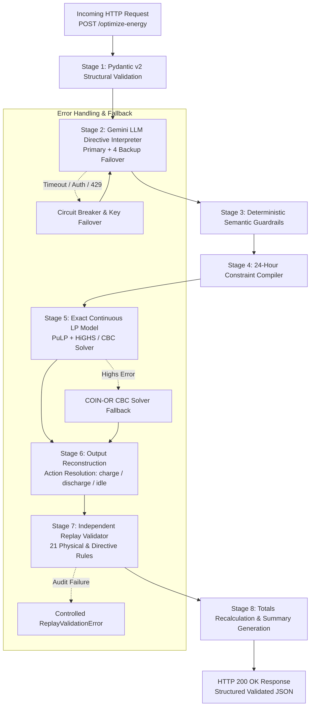
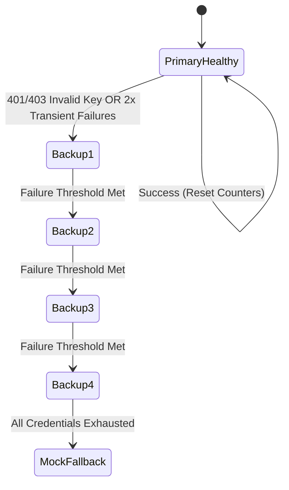

# GridWise Architecture & Design Specification

This document provides an in-depth architectural breakdown of the **GridWise LLM Energy Optimizer**, developed for the **BUP CSE Fest 2026 Hackathon Online Preliminary**.

---

## 1. System Philosophy & Core Design Principles

GridWise is engineered around the principle of **strict separation between natural language interpretation and deterministic optimization**:

1. **LLM as an Interpreter, Never as a Calculator**:
   Generative AI models excel at semantic nuance (extracting intents, identifying time windows, resolving relative percentages). However, LLMs are non-deterministic, prone to arithmetic hallucinations, and incapable of reliably solving linear programming problems with 24 continuous stages and tight boundary conditions. Hence, the LLM is restricted exclusively to parsing operator notes into structured, typed directive representations.
2. **Deterministic Guardrails on Untrusted Output**:
   Every output produced by the LLM is treated as untrusted user input. Before reaching the mathematical compiler, the directives undergo validation: note index matching, array range verification, numerical bound checking ($0.0 \le \text{factor} \le 1.0$), and null-safety enforcement.
3. **Exact Global Mathematical Optimization**:
   Energy scheduling is modeled as a continuous Linear Program (LP) across all 24 hours simultaneously and solved using the state-of-the-art **HiGHS** solver (with automated fallback to **COIN-OR CBC**). This guarantees mathematical optimality and minimal grid electricity expenditure.
4. **Independent Replay Validator (Zero Trust Audit)**:
   The optimizer's schedule is not trusted blindly. Before an HTTP 200 response is generated, an independent replay validator audits the hourly plan against 21 physical, electrical, and directive rules. If a single rule is violated, the request fails safely with a controlled error rather than returning an invalid schedule.
5. **Deterministic Totals as Single Source of Truth**:
   Summary metrics (`total_grid_kwh`, `total_cost_bdt`, `peak_grid_kwh`) are recomputed directly from the finalized `hourly_plan` rows to guarantee exact arithmetic consistency down to 0.01 precision.

---

## 2. End-to-End Pipeline Architecture

---

## 3. Pipeline Stages in Detail

### Stage 1: Request Validation (`app/schemas/request.py`)
- Validates the incoming JSON payload using Pydantic v2.
- Ensures exactly 24 hours are present ($h \in \{0, \dots, 23\}$) without duplicates or gaps.
- Enforces non-negative demands, solar yields, and tariffs.
- Enforces physical battery parameters: $\text{capacity} \ge 0$, $\text{initial\_energy} \in [\text{minimum\_energy}, \text{capacity}]$.
- Rejects `NaN`, `Infinity`, and malformed types with HTTP 400.

### Stage 2: Gemini LLM Interpretation (`app/llm/`)
- Invokes Google Gemini (`gemini-flash-lite-latest` by default) via async HTTP (`httpx`).
- Uses JSON schema enforcement and system prompts to extract structured directives.
- Features **Primary-First Failover**: attempts `GEMINI_API_KEY_PRIMARY`; if 401/403 (invalid key) or repeated 429/5xx occurs, automatically fails over to `GEMINI_API_KEY_BACKUP_1` through `_4`.
- Incorporates a **Fast LRU In-Memory Cache** keyed by `(scenario_notes, battery_capacity, model)` for instant repeat hits.

### Stage 3: Deterministic Guardrails (`app/core/guardrails.py`)
- Confirms the number of parsed directives matches the number of operator notes.
- Verifies that `note_index` matches $0, \dots, N-1$ in exact sequence.
- Audits directive parameters:
  - `solar_reduction`: `factor` $\in [0.0, 1.0]$, `hours` $\subset [0..23]$.
  - `minimum_battery_reserve`: `minimum_energy_kwh` $\in [0.0, \text{capacity\_kwh}]$.
  - `no_charge_window` / `no_discharge_window`: `hours` $\subset [0..23]$.
  - `max_grid_window`: `max_grid_kwh` $\ge 0.0$.
  - `no_op`: `applies == False` and `structured_adjustment is None`.

### Stage 4: Constraint Compiler (`app/core/constraint_compiler.py`)
- Translates high-level directives into 24-element hourly arrays:
  - `effective_solar[h]`: Solar forecast scaled by active reduction factors.
  - `min_battery_energy[h]`: Stored energy lower bounds for each hour.
  - `allow_charge[h]`: Boolean mask for charging permissions.
  - `allow_discharge[h]`: Boolean mask for discharging permissions.
  - `max_grid[h]`: Upper bound on grid electricity import.

### Stage 5: Continuous Linear Programming (`app/core/optimizer.py`)
- Formulates the 24-hour cost minimization problem in PuLP:
  $$\min \sum_{h=0}^{23} G[h] \times \text{tariff}[h]$$
  subject to:
  - Non-negative grid import ($G[h] \ge 0$, no feed-in unless specified).
  - Usable solar limit ($0 \le S[h] \le \text{effective\_solar}[h]$).
  - Flow balance ($G[h] + S[h] = \text{demand}[h] + B[h]$).
  - Battery capacity ($E[h] \in [\text{min\_battery\_energy}[h], \text{capacity\_kwh}]$).
  - Action masks ($B[h] \le 0$ if no charge; $B[h] \ge 0$ if no discharge).
  - Grid import cap ($G[h] \le \text{max\_grid}[h]$).
  - **End-of-day battery neutrality**: $E[23] = \text{initial\_energy\_kwh}$ (hard equality constraint).
- Solved globally with **HiGHS** (primary) or **CBC** (fallback).

### Stage 6: Output Reconstruction (`app/core/reconstruction.py`)
- Deconstructs continuous net battery flow $B[h]$ into competition-specified discrete fields:
  - If $B[h] > 10^{-7}$: `battery_action = "charge"`, `battery_kwh = B[h]`.
  - If $B[h] < -10^{-7}$: `battery_action = "discharge"`, `battery_kwh = |B[h]|`.
  - Otherwise: `battery_action = "idle"`, `battery_kwh = 0.0`.
- Calculates state of charge after each hour: $E[h] = E[h-1] \pm \text{battery\_kwh}$.

### Stage 7: Independent Replay Validator (`app/core/replay_validator.py`)
- Audits the finalized `hourly_plan` against 21 deterministic rules:
  1. Exactly 24 records ($h=0..23$).
  2. All quantities finite and $\ge 0$.
  3. Idle action enforces zero battery flow.
  4. Charge rate $\le \text{max\_charge\_kwh\_per\_hour} + 10^{-4}$.
  5. Discharge rate $\le \text{max\_discharge\_kwh\_per\_hour} + 10^{-4}$.
  6. Transition consistency: $|E[h] - (E[h-1] \pm \text{battery\_kwh})| \le 0.01$.
  7. Energy bounds: $E[h] \in [\text{min\_reserve}[h] - 0.01, \text{capacity} + 0.01]$.
  8. Solar utilization: $S[h] \le \text{effective\_solar}[h] + 0.01$.
  9. Prohibited charge window enforcement.
  10. Prohibited discharge window enforcement.
  11. Grid import cap enforcement: $G[h] \le \text{max\_grid}[h] + 0.01$.
  12. Hourly energy balance: $|(G + S + \text{discharge}) - (\text{demand} + \text{charge})| \le 0.01$.
  13. End-of-day neutrality: $|E[23] - E_{\text{init}}| \le 0.01$.

### Stage 8: Totals Recalculator (`app/core/totals.py` & `summary.py`)
- Recomputes `total_grid_kwh = sum(G[h])`, `total_cost_bdt = sum(G[h] * tariff[h])`, and `peak_grid_kwh = max(G[h])`.
- Generates a concise natural language explanation of the operational dispatch plan.

---

## 4. Resilience & Failover Architecture

- **Thread-safe**: Brief non-blocking lock during credential selection.
- **Budget-aware**: Halts failover attempts if remaining request deadline is $\le 0.3$ seconds.
- **Zero Leakage**: All keys stored as Pydantic `SecretStr`, masked in exception tracebacks and logs.
